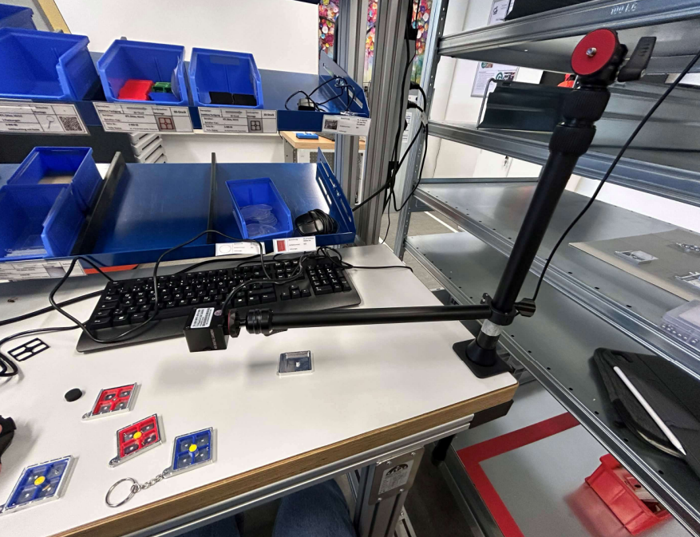
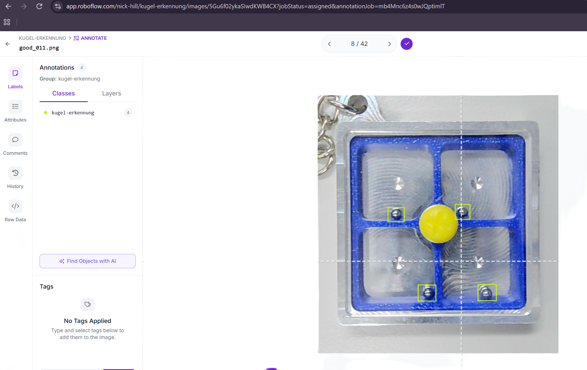
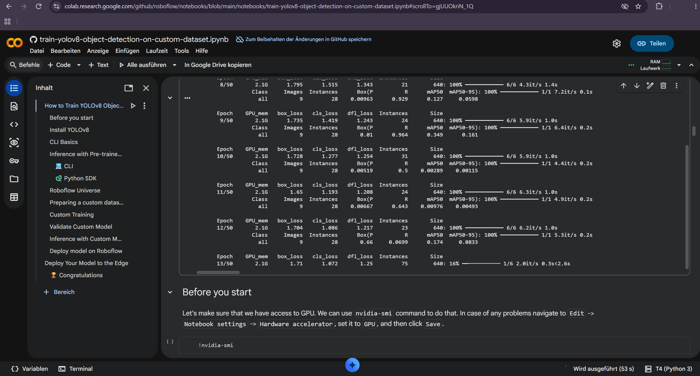

# Lernfabrik 4.0: KI-gestützte optische Qualitätsprüfung (Andon-System)

Autonomes, echtzeitfähiges Edge-Computer-Vision-Assistenzsystem zur 100%-Prüfung komplexer Multimaterial-Baugruppen (Schlüsselanhänger) an manuellen Montage- und Prüfstationen.

---

## Live-Demonstration

Die Benutzeroberfläche reagiert schnell auf das Einlegen von Bauteilen, führt eine dreistufige Analyse durch und schlägt bei Fehlern sofort optisch Alarm:


https://github.com/user-attachments/assets/263c2d34-01f8-47fe-8b8a-8c78e26a990e


---

## Projektüberblick & Problemstellung

In der realen Fertigung der Lernfabrik führen Maßabweichungen, Reflexionen auf gefrästem Aluminium oder Montagefehler (z. B. unvollständige Kugelsätze, falsche Inlay-Farben) zu Ausschuss. Die bisherige manuelle Sichtprüfung war fehleranfällig und ermüdend.

**Ziel des Projekts:** Entwicklung eines robusten, kostengünstigen Assistenzsystems nach dem Lean- und Andon-Prinzip, das Defekte ohne manuelle Sensoren meldet und auf wechselnden PCs ohne Administratorrechte lauffähig ist.

* **Hardware-Zusatzkosten:** < 50 € (Realisierung über ein stabiles Klemmstativ statt teurer industrieller Vision-Sensoren).
* **Betrieb:** 100 % Offline-Edge-Inferenz auf der CPU ohne Cloud-Abhängigkeiten oder laufende API-Kosten.


*Abbildung 1: Prüfaufbau am Shopfloor mit senkrechter Kameraführung und Beleuchtungsabschirmung.*

---

## Hybride Multi-Stufen-Architektur

Da reine Standard-Klassifikatoren oder geometrische Kantenerkennungen an spiegelnden Fräsrillen scheiterten, kombiniert das System deterministische Bildverarbeitung mit zwei spezialisierten KI-Modellen:

```
                          Kamera-Stream (Full-HD, DirectShow)
                                         │
                         [Virtuelle Präsenzerkennung]
                         (cv2.absdiff + Settle-Time 3,5 s)
                                         │
        ┌────────────────────────────────┼────────────────────────────────┐
        ▼                                ▼                                ▼
[Ebene 1: HSV-Filter]          [Ebene 1: YOLOv11n]              [Ebene 2: PaDiM]
• Rahmenfarbe: Blau            • Kugelanzahl: exakt 4           • Anomalie-Score
• Pin-Präsenz: Gelb            • Reflexionsresistent            • Oberflächenkratzer
        │                                │                                │
        └────────────────────────────────┼────────────────────────────────┘
                                         ▼
                            Hierarchische Auswertung
                         (Ausschuss bei Score > 0,70)
```

1. **Sensorlose Präsenzerkennung:** OpenCV-Differenzbildverfahren (`cv2.absdiff`) mit softwareseitiger Bewegungsentprellung (*Settle-Time: 3,5 s*), um Auslösungen durch die Hand des Einlegers zu eliminieren.
2. **Deterministische Merkmalsprüfung (HSV):** Geometrisch begrenzte Farbmasken zur Erkennung des blauen Rahmens und des gelben Zentrier-Pins.
3. **Objekterkennung (YOLOv11-Nano via OpenVINO):** Zählung der vier Stahlkugeln. Roboflow-gestütztes Training mit Augmentation (Helligkeit/Rotation) sichert die Erkennung auch bei Kugelverdeckungen und Reflexionen ab.
4. **Unüberwachte Anomalieerkennung (Intel Anomalib / PaDiM):** Training rein auf ~50 fehlerfreien Gut-Teilen. Detektiert unbekannte Fehlerbilder (Plexiglas-Kratzer, Ausbrüche), ohne dass Ausschussmuster antrainiert werden mussten.

<p align="center">
  
  
</p>
*Abbildung 2 & 3: Roboflow-Datensatzerstellung und Trainingslauf des YOLO-Nano-Modells.*

---

## Validierung & Testergebnisse

In realen Testreihen am Shopfloor wurden die Systemgrenzen iterativ optimiert:

| Prüfszenario | Stichprobe | Erkennungsrate | Maßnahme |
| :--- | :---: | :---: | :--- |
| **Gut-Teile (Lernfabrik)** | 25 | **96,0 %** | Entprellzeit & Fadenkreuz-Ausrichtung kalibriert |
| **Falsche Inlay-Farbe** | 15 | **100,0 %** | HSV-Schwellenwert auf > 7.000 Pixel parametrisiert |
| **Fehlende Kugeln (Soll: 4, Ist: 2)** | 15 | **93,3 %** | OpenVINO-Konvertierung & Bounding-Box-Filterung |
| **Gesamtvalidierung** | **30** | **93,3 %** | 28 von 30 Teilen über alle Varianten korrekt klassifiziert |

---

## Software-Design & Portabilität

* **Multithreading:** Bildakquise und Inferenz laufen in einem separaten Worker-Thread; die Benutzeroberfläche (PySide6) bleibt durchgehend responsiv.
* **Portable USB-Umgebung:** Dynamische relative Pfadauflösung (`pathlib.Path(__file__)`) verhindert Fehler bei wechselnden Windows-Laufwerksbuchstaben.

---

## Schnelleinstieg für Entwickler

Das Projekt nutzt den modernen Paketmanager [uv](https://github.com/astral-sh/uv) zur Abhängigkeitsverwaltung.

```bash
# Repository klonen
git clone https://github.com/lmaximeweber-rgb/Kamerasystem_zur_Ausschusserkennung_von_Schluesselanhaengern_Andon-System.git
cd Kamerasystem_zur_Ausschusserkennung_von_Schluesselanhaengern_Andon-System

# Abhängigkeiten installieren
uv sync

# Anwendung ausführen
uv run src/app.py
```

### Standalone-Paket (Zero-Install für Werker)
Für den produktiven Einsatz ohne Python-Installation steht unter **[Releases](../../releases)** ein vorkonfiguriertes Archiv bereit:
1. ZIP-Datei aus den Releases herunterladen und entpacken.
2. Anwendung per Doppelklick auf `Andon Prüfstation` starten (keine Admin-Rechte erforderlich).
